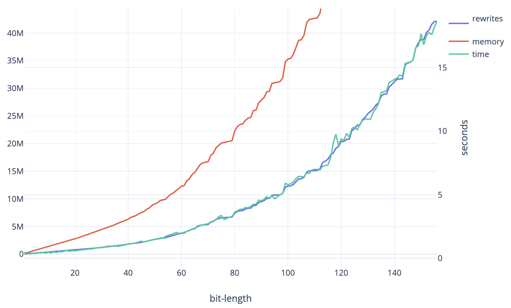

# Multiplication with optimal β-reduction

In this repository, I'll present an elegant multiplication algorithm that seems
to peform counter-intuitively well. The algorithm consists of mere 40 lines of
code in [Formality](https://github.com/moonad/formality), a new proof language
featuring optimal beta-reduction. It works by exploiting an effect I call
"runtime fusion", which allows you to compute `n` repeated function calls in
`O(log(n))` time by using compact, Church-Encoded natural numbers to
self-compose suitable functions. By applying this technique to the binary `inc`
function, we get an efficient `add` "for free", allowing us to implement an
elegant `mul` that performs faster than it should given how it is constructed. 



This charts the memory (in bytes), work (rewrites) and time it took the
algorithm to multiply two random numbers in function of the bit-length of each
number. It seems to be quadratic with a small constant, **even though it is
programmed in a way that should be exponential**. It is not fast compared to
big-integer techniques, but it highlights how some algorithms that look
impractical can be reasonably efficient on optimal evaluators. Keeping these
techniques in mind may allow a funtional programmer not to dismiss elegant ideas
that are more efficient than initially thought. 

Note that Formality's non-optimal back-ends (like JavaScript) are still much
faster in practice (and feature actual BigInts, so there is no need to implement
multiplication that way). But by exploring these techniques, and by improving
the optimal runtime, it could be a great alternative in a future. To learn more
about that, check ["Solving the mystery behind Abstract Algorithm’s magical
optimizations"](https://medium.com/@maiavictor/solving-the-mystery-behind-abstract-algorithms-magical-optimizations-144225164b07).

## Usage

To test the algorithm, run `npm i` on this dir, then `node with_formality`.
This will test the addition of numbers of increasing size. You can edit the
script as desired.

## The algorithm

The algorithm is simple and elegant. The full code is on
[global.fm](https://github.com/MaiaVictor/optimul/blob/master/global.fm).

### 1. Representing binary numbers with algebraic datatypes

First, we need a way to represent numbers. We do it with bit-strings, using an
algebraic datatype. In Haskell, we would write:

```haskell
data Bits
  = Bn
  | B0 Bits
  | B1 Bits
```

In Formality, we write instead:

```c
T Bits
| bn;
| b0(pred: Bits);
| b1(pred: Bits);
```

We let the leftmost bit to be the least significant, so, for example,
`b0(b0(b1(bn)))` represents the number 4. 

### 2. A fusible increment function

Then, we create a function that increments a bitstring. In Haskell, it'd be:

```haskell
inc : Bits -> Bits
inc Bn        = Bn
inc (B0 pred) = B1 pred
inc (B1 pred) = B0 (inc pred)
```

For example, `inc(110001) == 001001`. In Formality, we could write it as:

```c
inc(bs: Bits): Bits
  case bs:
  | bn => bn;
  | b0 => b1(bs.pred);
  | b1 => b0(inc(bs.pred));
```

But, since Formality datatypes are **lambda encoded**, we can lift the lambdas
and write, intead:

```c
inc(bs: Bits): Bits
  <P> (bn, b0, b1)
  case bs:
  | bn => bn;
  | b0 => b1(bs.pred);
  | b1 => b0(inc(bs.pred));
  : P(inc(bs.self));
```

This innocent optimization is essential for the algorithm, as it allows the
"headers" of the `bn`, `b1` and `b0` constructors to be "shared". This, in turn,
causes the composition of `inc . inc` not to grow in size, allowing it to fuse
and, thus, be called `n` times in `O(log(n))` time via compact Church Nats.

### 3. Fueling fusion with compact Church Nats

A Church Nat is a λ-term in the form `λs.λz.(s(s...(s(s(z)))))` A compact Church
Nat is one that "compresses" its own body by chaining "let" expressions. For
example, the term below, called `c255`:

```c
c255 = λs. λz.
  let p0 = s
  let p1 = λx. (p0 (p0 x))
  let p2 = λx. (p1 (p1 x))
  let p3 = λx. (p2 (p2 x))
  let p4 = λx. (p3 (p3 x))
  let p5 = λx. (p4 (p4 x))
  let p6 = λx. (p5 (p5 x))
  let p7 = λx. (p6 (p6 x))
  (p0 (p1 (p2 (p3 (p4 (p5 (p6 (p7 z))))))))
```

Is equivalent to `λs.λz.(s(s(s(s...255-times...z))))`, but in a much shorter
form. In an optimal evaluator, we can use `c255` to apply `inc` `n` times to a
bit-string in `O(log(n))` time. For example, `id(c4294967296(inc, b0(b0(b0(b0(b0(...bn)))))))`
would apply `inc` about 4 billion times, yet it would halt in much less than 4
billion steps. To convert a Bits to a compact Church Nat, we just write a
`repeat` function that applies `f` repeatedly to `x`:

```c
// Applies a function n times repeatedly to an argument
repeat(bs: Bits)<P: Type>(s: P -> P, z: P): P
  case bs:
  with s:_ = s;
  with z:_ = z;
  | bn => z;
  | b0 => repeat(bs.pred)<P>((x) s(s(x)), z);
  | b1 => repeat(bs.pred)<P>((x) s(s(x)), s(z));
```

### 4. Layering fused increments to perform multiplications

The final step of the algorithm is to convert the first number, `a`, to a
compact Church Nat, and use it to build `add(a,b)` as a function that applies
`inc` `a` times. Then we just recurse through `b`, replacing each occurrence of
`b1(...)` by `add(a,(b0(...)))`. This results in `c = Σ(a * 2^i)` for each set
bit `i` on `b`, which is `a * b`. For example, with `a = 6` and `b = 37`, we'd
get:

```
c = add(6,b0(b0(add(6,b0(b0(b0(add(6,b0(be)))))))))
```

Which is the same as `6 + 6*2^2 + 6*2^5`, which is `222` (`6 * 37`).

```c
// Adds two Bits by using repeated incs
add(a: Bits, b: Bits): Bits
  repeat(a)<Bits>(inc, b)

// Multiplies two bit strings
mul(a: Bits, b: Bits): Bits
  id(mul.go(add(a), b))

// Helper function
mul.go(f: Bits -> Bits, bs: Bits): Bits
  case bs:
  with go:_ = mul.go;
  | bn => bn;
  | b0 => b0(go(f, bs.pred));
  | b1 => f(b0(go(f, bs.pred)));
```

## Conclusion

The catch is that, if we implemented this algorithm in any non-optimal
functional language, it would be exponential, since we're performing `2^n` calls
to `inc` (with `n` being the bit-size of `a`). The fusion technique allowed us
to turn `inc` into an efficient `add` by mere repetition, without ever having to
reason about carry bits, and without losing any efficiency, which is what makes
it interesting.

The `global.fm` file can be type-checked with `fm`, and you can run it with
`fmopt test` (edit the `test` term as suited). It will print the result as a
λ-term. There is a pretty-printer on the `with_formality.js` file.
